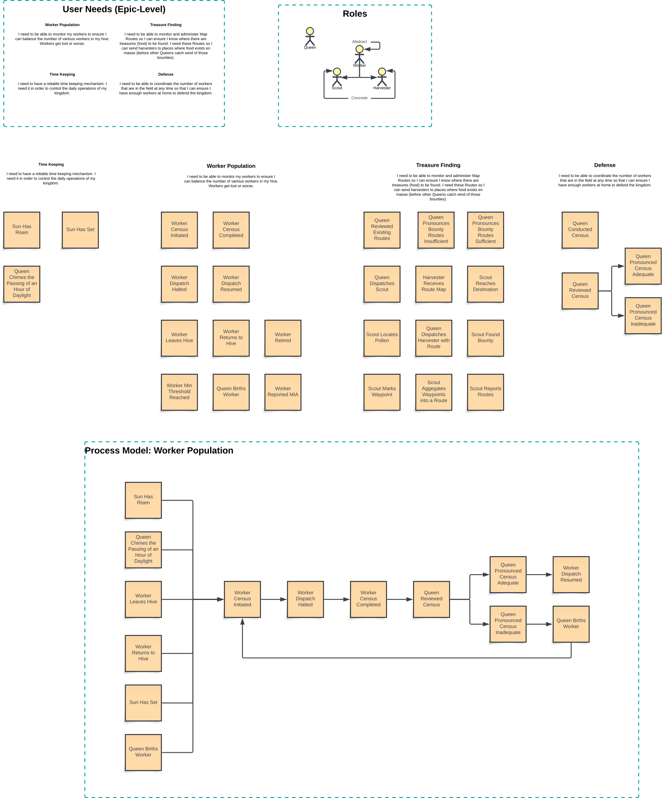

# Overview

This is a demo app that I rapidly put together (over the course of a weekend) to demonstrate three key capabilities of mine:

1. I understand and can work with React (not my primary forté as I've been focused primarily on backend development for
   the last year using Next.js as an API service).
2. I have an expert level understanding of application design: understanding how to separate system concerns in a
   scalable and maintainable way that lends itself to a monolithic application being capable of being cut into multiple
   interacting applications... and...
3. I have an advanced to expert degree of understanding of Domain Modelling coupled with a demonstrable acuity for
   large, enterprise-scale Domain Driven Design.

Within this app, I've saved a Lucid App export of the Domain Driven Design model that I put together to act as the
inspiration for this application. The DDD model illustrates a fictional world where Queen Bees use an ERP of sorts to
monitor and facilitate the oversight of their Queendoms.

The Domain Model provides insight into the types of concerns that a Queen Bee may have. For example, they need to keep
track of the number of Workers alive in the hive and, in the course of a day, if some Workers don't return home, they
need (unfortunately) to be logged as MIA and, the Queen needs to give birth to a replacement worker. The following are a
few more of the concerns:

* **Defense**: Controlling the number of Workers present in the hive for protection.
* **Bounty (aka Food) Location**: Keep track of Routes that lead to food sources, dispatching Scouts to locate food caches
  and Harvesters to go and collect food.
* **Warehousing**: Keep track of the available storage of food and ensure more food isn't brought in than the hive has
  capacity to store... We're not a wasteful Queendom after all!
* **Population to Sustenance Ratio**: Make sure that there's enough food for all workers to thrive.

The list of business rules and concerns that the Queen Be worries about could go on for quite a while so!... Thus, let's let the above suffice for now!

# Technologies

* The app is a pure React app, no Router, no API, no nuthin! (at present)
* Time permitting, the idea is to setup a read-only server that acts as the source of the data to demonstrate use of Axios and/or Fetch API to retrieve data.
* I've incorporated `Zustand` as a state manager instead of relying on React Context.
* I intend to incorporate `Immer` as well to help manage React Memoize optimisations when the app's reactive nature becomes more complex as more business rules are implemented alongside more Routes and a more complex Component Tree.

# Completed Functionality

1. The app has a simple UI - a single page (with horrible UX design I might add 😳) - that displays two buttons: `Dispatch Scout` and `Dispatch Harvester`.
2. There is a UI Component acting as an "In Hive Worker Dashboard" that displays the number of workers currently located both in the hive (and available for both dispatch and defense) along with the number of workers in the field.
3. When the `Dispatch Scout` button is clicked, the number of Scouts "At Home" is decremented and, after a timeout, two things happen:
   1. The Scout "finds" a Bounty Location which is then added to the Bounty Component and...
   2. The Scout then "returns home" after another stretch of time.
4. If the `Dispatch Harvester` button is clicked, the same Population decrement-timeout-increment indicators run but, at time of writing, nothing else happens.

# Future Plans

The idea is to make this a light, text-only style numbers game, similar in concept to a Civilizations and/or SimCity style game where the Queen Bee needs to balance the number of Workers at home with the amount of Food in Warehouses and the dispatching of Scouts/Harvesters to keep the Hive's food stores stocked.

1. Convert this to a Monolith codebase that includes two root-level projects in the repo: 1) a backend platform developed using Encore.ts (or Encore.go time permitting) and 2) the React app that I've got here already.
2. Move the data out of the `./src/_assets/data/db.ts` file and into a DB fixture used by the proposed API backend app.
3. Build out and hydrate (pun intended) the React frontend app with much more complex business logic including a randomised timer-based attack on the Hive from an external force like a rival Queen Bee or perhaps a rodent or, bear? 🐻 🤣
4. More, more, more... this is fun!

# Dev

* Run `yarn` to install dependencies.
* Run `yarn dev` to start the server; as this is a Vite bundled project, the app will be available on
  `http://localhost:5173/`

# Deploy

This is not currently a deployable app in terms of CI/CD workflows and doesn't include any sort of unit/automated testing.
